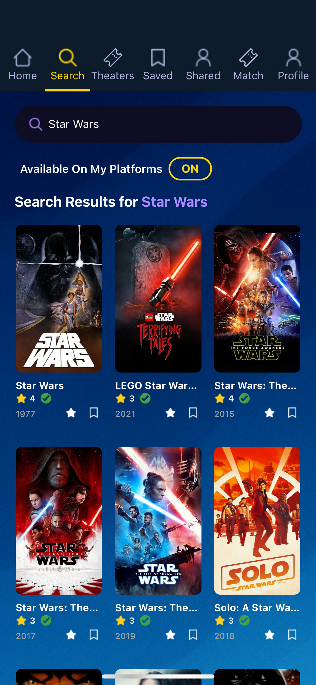
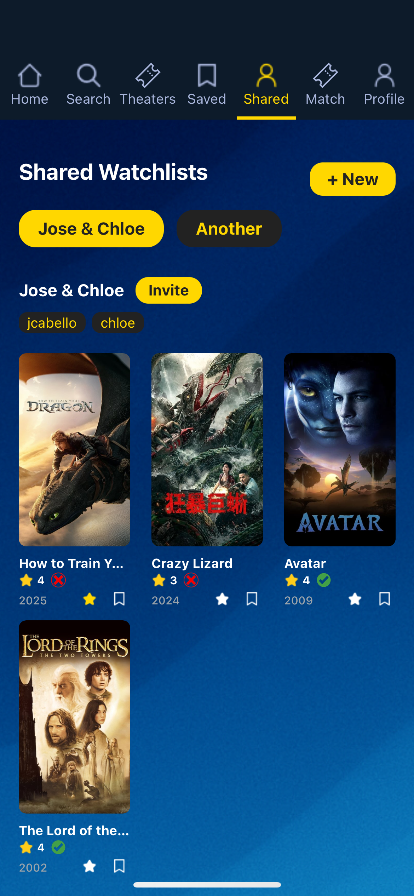
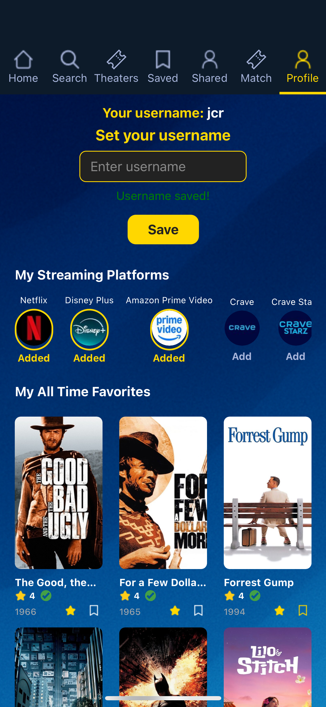

# 🎬 Movie Companion App

<div align="center">


**Your ultimate movie discovery and social sharing companion**

*Discover movies, share watchlists, and find your perfect match with friends!*

[Features](#-features) • [Screenshots](#-screenshots) • [Installation](#-installation) • [Tech Stack](#-tech-stack)

</div>

---

## ✨ Features

### 🏠 **Movie Discovery**
- **Trending Movies**: Stay up-to-date with the hottest movies
- **Personalized Recommendations**: AI-powered suggestions based on your favorites
- **Advanced Search**: Find any movie with powerful search functionality
- **In Theaters**: Discover what's currently playing in cinemas

### 🎯 **Movie Matching System**
- **Collaborative Matching**: Invite friends to find movies you both want to watch
- **Swipe-Based Interface**: Tinder-style swiping for movie selection
- **Real-time Sync**: Matches appear instantly when both users swipe right
- **Infinite Discovery**: Never run out of movies to match on

### 💾 **Personal Watchlists**
- **Save Favorites**: Build your personal movie collection
- **Smart Organization**: Automatically organized and easily accessible
- **Watch Status**: Track what you've watched and what's on your list

### 👥 **Social Features**
- **Shared Watchlists**: Create and share watchlists with friends
- **User Profiles**: Set up your movie personality
- **Collaborative Discovery**: Find movies together with your movie buddies

### 🎭 **Rich Movie Details**
- **Comprehensive Info**: Cast, crew, budget, revenue, and more
- **Streaming Availability**: See where to watch each movie in Canada
- **Trailers**: Watch movie trailers directly in the app
- **High-Quality Posters**: Stunning visual presentation

---

## 📱 Screenshots

<div align="center">

### Home & Discovery




### Movie Details & Watchlists


### Social Features



</div>

---

## 🚀 Installation

### Prerequisites
- Node.js (v16 or higher)
- npm or yarn
- Expo CLI
- iOS Simulator or Android Emulator (for development)

### Setup

1. **Clone the repository**
   ```bash
   git clone https://github.com/josecr02/Movie-Companion-App.git
   cd Movie-Companion-App
   ```

2. **Install dependencies**
   ```bash
   npm install
   ```

3. **Environment Configuration**
   Create a `.env` file in the root directory:
   ```env
   EXPO_PUBLIC_TMDB_API_KEY=your_tmdb_api_key
   EXPO_PUBLIC_APPWRITE_ENDPOINT=your_appwrite_endpoint
   EXPO_PUBLIC_APPWRITE_PROJECT_ID=your_appwrite_project_id
   EXPO_PUBLIC_APPWRITE_DATABASE_ID=your_database_id
   EXPO_PUBLIC_APPWRITE_MOVIES_COLLECTION_ID=your_movies_collection_id
   EXPO_PUBLIC_APPWRITE_WATCHLISTS_COLLECTION_ID=your_watchlists_collection_id
   EXPO_PUBLIC_APPWRITE_MATCHES_COLLECTION_ID=your_matches_collection_id
   EXPO_PUBLIC_APPWRITE_USERS_COLLECTION_ID=your_users_collection_id
   ```

4. **Start the development server**
   ```bash
   npx expo start
   ```

5. **Run on your device**
   - Scan the QR code with Expo Go app (iOS/Android)
   - Or press `i` for iOS Simulator / `a` for Android Emulator

---

## 🛠 Tech Stack

### **Frontend**
- **React Native** - Cross-platform mobile development
- **Expo** - Development platform and tools
- **TypeScript** - Type-safe JavaScript
- **NativeWind** - Utility-first CSS for React Native
- **React Navigation** - Navigation library

### **Backend & Services**
- **Appwrite** - Backend-as-a-Service for database and real-time features
- **TMDb API** - Movie data and metadata
- **React Native WebView** - In-app video playback

### **UI/UX**
- **React Native Deck Swiper** - Tinder-style card swiping
- **Custom Components** - Tailored movie cards and interfaces
- **Responsive Design** - Optimized for all screen sizes

### **State Management**
- **React Context** - Global state management
- **Custom Hooks** - Reusable logic and API calls
- **AsyncStorage** - Local data persistence

---

## 🎯 Key Features Breakdown

### **Movie Matching Algorithm**
Our innovative matching system allows users to:
- Create collaborative sessions with friends
- Swipe through an infinite feed of movies
- Get instant notifications when both users like the same movie
- Track match history and discover new preferences

### **Smart Recommendations**
- **Collaborative Filtering**: Based on your saved movies and ratings
- **Trending Integration**: Incorporates current popular movies
- **Genre Preferences**: Learns from your viewing history
- **Social Recommendations**: Suggestions from friends' watchlists

### **Real-time Synchronization**
- **Live Updates**: Changes sync instantly across all devices
- **Offline Support**: Works without internet, syncs when reconnected
- **Conflict Resolution**: Smart handling of simultaneous edits

---

## 🤝 Contributing

We welcome contributions! Please feel free to submit a Pull Request. For major changes, please open an issue first to discuss what you would like to change.

---

## 📄 License

This project is licensed under the MIT License - see the [LICENSE](LICENSE) file for details.

---

## 🙏 Acknowledgments

- **TMDb** for providing comprehensive movie data
- **Appwrite** for backend infrastructure
- **Expo** for the amazing development experience
- **React Native Community** for the awesome ecosystem

---

<div align="center">

**Made with ❤️ and lots of ☕**

*Start your movie journey today!*

</div>
